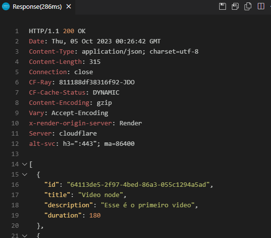

# node-do-zero
 <h1 align="center"> Node do Zero</h1>

  <a href="#-tecnologias">Tecnologias</a>&nbsp;&nbsp;&nbsp;|&nbsp;&nbsp;&nbsp;
  <a href="#-projeto">Projeto</a>&nbsp;&nbsp;&nbsp;|&nbsp;&nbsp;&nbsp;
  <a href="#memo-licença">Licença</a>

 

  

## 🚀 Tecnologias

Esse projeto foi desenvolvido com as seguintes tecnologias:  

<ul>
  <li>Node.js</li>
  <li>Dotenv</li>
  <li>Postgres</li>
  <li>Fastify</li>
</ul>

## 💻 Projeto

Projeto criado com base em um vídeo de iniciação de Node.js a fim de conhecer os principios e principais funcamentos dessa tecnologia. 
  -Passo a passo para usar do projeto:  
  <ol>
    <li>Faça o clone desse projeto na sua maquina;</li>
    <li>Abra o mesmo no VScode e tenha a extensão REST Client instalada;</li>
    <li>Postgres</li>
    <li>Abra o arquivo routes.http e clique no 'Send request' nas funções que você quiser.</li>
  </ol>

- [Visite o projeto online](https://node-do-zero-5yuv.onrender.com/)

## :memo: Licença

Esse projeto está sob a licença MIT.

---

Feito com ♥ by Helena Lima :wave: [Meu Portifólio:]([https://discord.gg/rocketseat](https://portifolio-principal-three.vercel.app/)https://portifolio-principal-three.vercel.app/)
